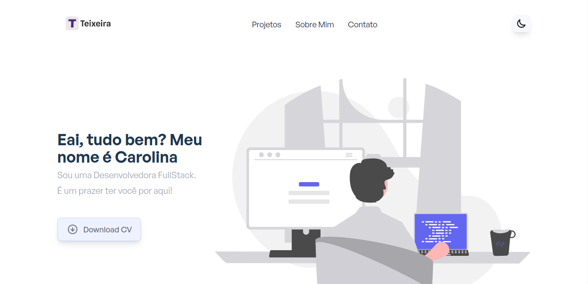

<h1 align="center">Portfolio</h1>

 
<!-- Imagem que representa o que o projeto faz-->


## Index
  1. [Descrição do Projeto](#descrição)
  2. [Técnicas e Tecnologias](#tecnologias)
  3. [Abrir e executar o projeto](#executar_o_projeto)
  4. [Features do Projeto](#project_features)
  4. [Pessoas que ajudaram a desenvolver o projecto](#developers)
  5. [English Readme](./READMEEnglish.md)

### Descrição do Projeto 
###### descrição
Um portfólio simples construído com Nuxt.js e Tailwind CSS.

### Técnicas e Tecnologias
###### tecnologias
- Vue
- Vuex 
- Nuxt
- TailwindCss
- Feather-icons

## 🛠️ Abrir e executar o projeto
###### executar_o_projeto
1. #####  Primeiro de tudo, certifique-se de ter instalado o Nodo JS. Se você não o tiver:

- [Download it from nodejs.org](https://nodejs.org)
- [Install it using NVM ](https://github.com/nvm-sh/nvm)
- Se você está no Mac, o homebrew é uma boa opção também:

```
brew install node
```

2. ##### Clonar o repo:

```
git clone https://github.com/caroolt/carool-portfolio.git
```

3. ##### Abra a pasta do projeto:

```
cd nuxtjs-tailwindcss-portfolio
```

4. ##### Instalar pacotes e dependências:

```
yarn
```

4. NOTA: Se você não tiver Yarn instalados, você pode instalá-lo globalmente usando npm:

```
npm install --global yarn
```

5. ##### Inicie um servidor de desenvolvimento local em `http://localhost:3000`:

```
yarn dev
```

## Para production, construir e gerar arquivos estáticos:

##### Construir para production e lançar o server:

```
yarn build
```

```
yarn start
```

##### Gerar projeto estático:

```
yarn generate
```


### :hammer: Features do Projeto
###### project_features
- Design simples e responsivo
- [Nuxt.js](https://nuxtjs.org) with [Vuex](https://vuex.vuejs.org/)
- [Tailwind CSS v2](https://tailwindcss.com)
- Theme Switcher com Modo Escuro
- Vuex para a gestão de states
- Componentes reutilizáveis
- Projetos filtram por categoria
- Busca de projetos por título
- Vue transitions
- Contador
- Carrossel de projetos
- Smooth scroll
- Formas dinâmicas
- Voltar ao topo do botão
- Botão de download de arquivo

## Desenvolvedora do projeto
###### developers
| [<br><sub>Carolina Teixeira Coelho</sub>](https://github.com/caroolt) | 
| :---: |


